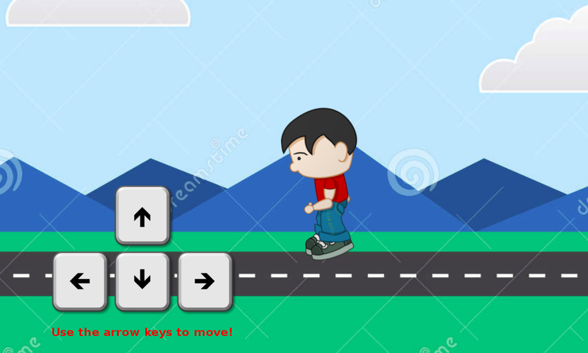

# Example css sprites and jquery animation

An example to illustrate how easy it is to move objects with jQuery, building small iterative animations.

*Open index.html*

*Use the arrow keys to move*

